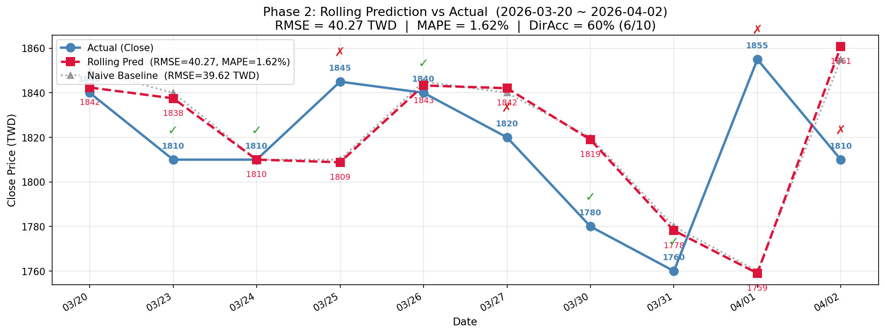

# Homework 1: TSMC Stock Prediction via LSTM + Attention

**Course:** RNN and Transformer  
**Assignment:** Stock Prediction & Live Trading Competition based on LSTM  
**Target Stock:** TSMC (2330.TW)  
**Competition Period:** 2026-03-20 ~ 2026-04-02（10 trading days）  
**GitHub:** [fader2077/Recurrent-Neural-Network-and-Transformer-HW](https://github.com/fader2077/Recurrent-Neural-Network-and-Transformer-HW/tree/main/hw1)

---

## 1 前言與研究動機（Introduction）

台積電（TSMC, 2330.TW）為全球最大晶圓代工廠，股價受半導體景氣循環、地緣政治風險與法人資金流向影響，兼具強趨勢性與高波動性，是驗證深度學習金融預測的理想標的。

本實驗以 **Stacked LSTM + Bahdanau Attention** 模型（PyTorch 實作）預測台積電日收盤價。研究目標如下：

1. **Phase 1（模型調校）**：建立 PyTorch Baseline，系統性進行 17 項超參數實驗（sequence length、model architecture、learning rate、batch size、dropout rate、feature set），找出最佳超參數組合。
2. **Phase 2（滾動預測）**：在 10 個交易日中採用 rolling retrain 策略，每日預測隔日收盤價，評估模型的動態泛化能力。
3. **Phase 3（模擬交易競賽）**：以 10,000,000 TWD 虛擬資金參賽，結合 Z-Score 訊號、Monte-Carlo Dropout（MC100）投票機制與 regime-flip 偵測器進行交易決策，驗證模型在實際投資場景中的應用潛力。

---

## 2 資料來源與前處理（Data & Preprocessing）

### 2.1 資料集

| 項目 | 內容 |
|---|---|
| 來源 | 台積電（2330.TW）日 K 線資料（2330_stock_data.csv） |
| 日期範圍 | 2016-01-04 ~ 2026-04-02 |
| 總筆數 | 2,403 rows（交易日） |
| 欄位 | Date, Open, High, Low, Close, Volume |
| 資料品質 | 無缺值，已過濾非交易日與異常值 |

### 2.2 訓練 / 測試切分

- **Train Set**：2016-01-04 ~ 2026-03-19（2,393 筆）
- **Test Set**：2026-03-20 ~ 2026-04-02（10 筆，對應競賽視窗）
- 切分原則：嚴格時間序列切分（Time-Series Split），無未來資訊洩漏（no look-ahead bias）

### 2.3 特徵工程

Phase 1 Baseline 僅使用收盤價（CloseOnly）。後續特徵選擇實驗加入以下技術指標：

| \# | 特徵名稱 | 計算方式 | 金融意義 |
|---|---|---|---|
| 1 | **Close** | 原始收盤價 | 主要預測目標錨點 |
| 2 | **SMA\_5** | 5 日簡單移動平均 | 短期趨勢 |
| 3 | **SMA\_20** | 20 日簡單移動平均 | 中期趨勢 / 黃金交叉信號 |
| 4 | **RSI\_14** | 14 日相對強弱指標（0–100） | 超買（>70）/ 超賣（<30）動能 |
| 5 | **MACDh** | MACD Histogram（12-26-9） | 趨勢動能加速或減速 |
| 6 | **BBP** | Bollinger Band Percentile（20日, 2σ） | 均值回歸信號 |
| 7 | **ATR\_14** | 14 日平均真實波幅 | 市場波動率大小 |
| 8 | **STOCHk** | 隨機指標 %K（14-3-3） | 短期動能超買超賣 |

**三種 Feature Set 定義：**
- **CloseOnly**：僅 Close（1 維）
- **TechCore**：Close + SMA\_5 + SMA\_20 + RSI\_14（4 維）
- **TechEnhanced**：以上全部 8 維

### 2.4 正規化

所有特徵以 `MinMaxScaler` 映射至 \[0, 1\]，**僅在訓練集上 fit**，再 transform 至測試集，確保無資訊洩漏。

### 2.5 預測目標

模型輸出為 **log-return**：

$$r_t = \ln\!\left(\frac{P_t}{P_{t-1}}\right)$$

評估時透過逆轉換（$P_t = P_{t-1} \cdot e^{r_t}$）還原至價格空間，計算 RMSE、MAE、MAPE。

---

## 3 模型架構（Model Architecture）

### 3.1 整體架構

本實驗採用 **Stacked LSTM + LayerNorm + Residual Connection + Bahdanau Attention** 架構（PyTorch 2.6.0+cu124，NVIDIA RTX 4090）：

```
Input: [Batch, look_back, input_size]
  ↓
LSTM Layer 1 (hidden_size = H1)
  + LayerNorm(H1)
  + Residual: LN(LSTM_out + Proj(input))   ← Linear projection if input_size ≠ H1
  ↓
LSTM Layer 2 (hidden_size = H2)
  + LayerNorm(H2)
  + Residual: LN(LSTM_out + Proj(prev))    ← Linear projection if H1 ≠ H2
  ↓
Bahdanau Attention over all T timesteps
  ↓
FC Head: Linear(H2→H2) → GELU → Dropout → Linear(H2→1)
  ↓
Output: predicted log-return r̂_{t+1}
```

### 3.2 Bahdanau Attention 機制

對 LSTM 全部 $T$ 個時間步的隱藏狀態進行學習式加權：

$$e_t = \mathbf{v}^\top \tanh\!\bigl(\mathbf{W}\,\mathbf{h}_t\bigr), \qquad
\alpha_t = \frac{\exp(e_t)}{\sum_{k=1}^{T}\exp(e_k)}, \qquad
\mathbf{c} = \sum_{t=1}^{T} \alpha_t\,\mathbf{h}_t$$

其中 $\mathbf{W} \in \mathbb{R}^{H_2 \times H_2}$，$\mathbf{v} \in \mathbb{R}^{H_2}$。Attention 使模型自動聚焦於對當前預測最相關的歷史時間步，而非僅依賴最後一個隱藏狀態。

### 3.3 Residual Connection + LayerNorm

每個 LSTM 層輸出加入殘差連接，防止深層網路梯度消失：

$$\tilde{\mathbf{h}}_t^{(l)} = \text{LayerNorm}\!\bigl(\mathbf{h}_t^{(l)} + \text{Proj}(\mathbf{h}_t^{(l-1)})\bigr)$$

若前一層輸出維度與當前層不同，`Proj` 為線性映射；若相同則為恆等映射。

### 3.4 訓練設定（Phase 1 Baseline）

| 超參數 | 值 |
|---|---|
| Optimizer | Adam（weight\_decay=0） |
| Loss | MSELoss（log-return 空間） |
| Learning Rate | 0.001 |
| LR Scheduler | ReduceLROnPlateau（factor=0.5, patience=5） |
| Batch Size | 32 |
| Max Epochs | 150 |
| Early Stopping | patience=10（監控 Validation Loss） |
| Dropout | 0.2 |
| 參數初始化 | LSTM → Orthogonal Init；Linear → Xavier Uniform |
| 決定論設定 | `CUBLAS_WORKSPACE_CONFIG=:4096:8`，`torch.use_deterministic_algorithms(True)` |

### 3.5 最終生產模型（Final Production Model，用於 Phase 3）

| 超參數 | 值 |
|---|---|
| Architecture | LSTM[128, 64]，look\_back=60，TechEnhanced（8 維） |
| Loss | CombinedLoss（見下） |
| Max Epochs | 1000，Min Epochs = 600 |
| Early Stopping | patience=20（監控 Val VarianceLoss） |

**CombinedLoss 定義：**

$$\mathcal{L} = 0.28 \cdot \mathcal{L}_{\text{SmoothL1}} + 0.12 \cdot \mathcal{L}_{\text{dir}} + 0.55 \cdot \mathcal{L}_{\text{var}} + 0.05 \cdot \mathcal{L}_{\text{mean}}$$

| 損失組件 | 權重 | 設計目的 |
|---|---|---|
| SmoothL1 | 0.28 | 穩健回歸，對離群值不敏感 |
| DirectionLoss | 0.12 | 懲罰方向預測錯誤，直接最佳化交易信號 |
| **VarianceLoss** | **0.55** | **防止預測崩塌**（輸出恆≈0），確保 pred\_std ≥ 85% target\_std |
| MeanLoss | 0.05 | 約束預測均值接近目標均值，防止系統性偏移 |

---

## 4 Phase 1：基準模型（Baseline）

### 4.1 實驗設定

| 項目 | 設定 |
|---|---|
| Feature Set | CloseOnly（1 維） |
| look\_back | 100 天 |
| Architecture | LSTM[128, 64] |
| LR / Batch Size / Max Epochs | 0.001 / 32 / 150（Early Stopping patience=10） |
| Dropout | 0.2 |
| 預測目標 | log-return → 轉換回價格空間評估 |

### 4.2 Baseline 評估結果

**Table 1: Baseline 模型評估結果（Test: 2026-03-20 ~ 2026-04-02）**

| 資料集 | RMSE (TWD) | MAE (TWD) | MAPE | Actual Epochs |
|---|---|---|---|---|
| Train | 9.54 | — | 1.25% | — |
| Test | **40.07** | 31.82 | **1.75%** | 41 |

> Baseline 以 41 個 epoch 早停，測試集 RMSE = 40.07 TWD，MAPE = 1.75%，為後續 16 項超參數實驗的比較基準。

---

## 5 Phase 1：超參數調整（Hyperparameter Tuning）

### 5.1 實驗設計原則

所有實驗採用**控制變量法**：每次僅調整一個超參數維度，其餘固定與 Baseline 相同，確保結果可比性。資料切分、隨機種子（seed=42）與評估指標（價格空間 RMSE/MAPE）完全一致。

### 5.2 Exp 1：序列長度（look\_back）

**實驗目的：** 探討輸入歷史視窗長度的影響。視窗過短無法捕捉中期趨勢，視窗過長引入遠期雜訊。

**Table 2: 不同 look\_back 設定之模型評估結果**

| look\_back | Actual Epochs | Train RMSE | Train MAPE | Test RMSE | Test MAPE | Δ RMSE vs Baseline |
|---|---|---|---|---|---|---|
| **100（Baseline）** | **41** | **9.54** | **1.25%** | **40.07** | **1.75%** | — |
| 60 | 53 | 9.18 | 1.24% | 40.47 | 1.81% | +0.40 (+1.0%) |
| 90 | 26 | 9.62 | 1.27% | 40.59 | 1.83% | +0.52 (+1.3%) |
| 120 | 38 | 9.75 | 1.26% | 40.61 | 1.83% | +0.54 (+1.3%) |

**分析：**
- Baseline（100天）同時取得最低 Train RMSE 之外的最低 Test RMSE，is both訓練穩定且泛化最佳。
- look\_back=60：Train RMSE 最低（9.18），但測試集 RMSE 最高（40.47），顯示短視窗輕微過擬合。
- look\_back=90/120：Early Stopping 觸發更早，遠期雜訊使泛化能力下降（RMSE 40.59/40.61）。
- **結論：** 保留 look\_back=100。

### 5.3 Exp 2：模型架構（LSTM Hidden Size / Layers）

**實驗目的：** 比較不同寬度與深度的 LSTM 架構，探索最佳模型容量（capacity）。

**Table 3: 不同 LSTM 架構之模型評估結果（look\_back=100）**

| LSTM 架構 | Actual Epochs | Train RMSE | Train MAPE | Test RMSE | Test MAPE | Δ RMSE vs Baseline |
|---|---|---|---|---|---|---|
| **[128, 64]（Baseline）** | **41** | 9.54 | 1.25% | 40.07 | 1.75% | — |
| [64, 32] | 31 | 9.60 | 1.26% | 40.45 | 1.81% | +0.38 (+0.9%) |
| **★ [256, 128]** | **26** | **9.49** | **1.23%** | **39.86** | **1.71%** | **−0.21 (−0.5%)** |
| [128, 64, 32] | 45 | 9.65 | 1.27% | 40.93 | 1.87% | +0.86 (+2.1%) |
| [256, 128, 64] | 35 | 9.61 | 1.26% | 41.00 | 1.88% | +0.93 (+2.3%) |

**分析：**
- **[256, 128]（最佳）**：更大容量（~262K 參數 vs ~68K）提升特徵萃取，同時 Train/Test RMSE 均最低，無過擬合跡象。更寬的隱藏層梯度路徑更豐富，有助學習台積電的非線性趨勢。
- **[64, 32]（容量不足）**：~20K 參數量不足，表達能力有限，Test RMSE 40.45。
- **三層架構（[128,64,32] & [256,128,64]）**：增加深度不改善泛化，最差組（RMSE > 40.9）。在 10 條測試序列的短評估集中，深層網路可能梯度流動不穩定，且高頻短期特徵被過度抽象化。
- **結論：** [256, 128] 為 Phase 1 全局最佳，Test RMSE 39.86，MAPE 1.71%。

### 5.4 Exp 3：訓練超參數（LR / Batch Size / Epochs）

**Table 4: 不同訓練參數之模型評估結果（LSTM[128,64], look\_back=100）**

| LR | Batch Size | Max Epochs | Actual Epochs | Train RMSE | Train MAPE | Test RMSE | Test MAPE | Δ RMSE |
|---|---|---|---|---|---|---|---|---|
| **0.001（Baseline）** | **32** | **150** | **41** | **9.54** | **1.25%** | **40.07** | **1.75%** | — |
| 0.0005 | 32 | 150 | 41 | 9.72 | 1.30% | 40.88 | 1.87% | +0.81 |
| 0.005 | 32 | 150 | 44 | 9.61 | 1.26% | 40.92 | 1.87% | +0.85 |
| 0.001 | **16** | 150 | 32 | 9.62 | 1.26% | 41.14 | 1.90% | +1.07 |
| 0.001 | **64** | 150 | 40 | 9.56 | 1.25% | 40.14 | 1.76% | +0.07 |
| 0.001 | 32 | **100** | 41 | 9.54 | 1.25% | 40.07 | 1.75% | 0.00 |

**分析：**
- **LR=0.001** 已是 Adam 的合理預設值；降至 0.0005 收斂過慢；提高至 0.005 則在 ReduceLROnPlateau 調降前出現輕微振盪。
- **BS=64** 接近 Baseline（+0.07）；**BS=16** 最差（+1.07），小批次雜訊過大且 Early Stopping 僅跑 32 epochs 就停止，模型未充分收斂。
- **Epochs=100 vs 150**：Early Stopping 均在 41 epoch 觸發，結果完全相同，驗證 Early Stopping 有效。
- **結論：** LR=0.001、BS=32 為最佳訓練設定。

### 5.5 Exp 4：Dropout 正則化

**Table 5: 不同 Dropout Rate 之模型評估結果（LSTM[128,64], look\_back=100）**

| Dropout Rate | Actual Epochs | Train RMSE | Train MAPE | Test RMSE | Test MAPE | Δ RMSE |
|---|---|---|---|---|---|---|
| **0.2（Baseline）** | **41** | **9.54** | **1.25%** | **40.07** | **1.75%** | — |
| 0.1 | 41 | 9.59 | 1.27% | 40.24 | 1.78% | +0.17 |
| 0.3 | 50 | 9.63 | 1.26% | 41.05 | 1.89% | +0.98 |

**分析：**
- Dropout=0.2 最佳；0.1 差異不大（+0.17）；0.3 明顯惡化（+0.98）。
- 台積電股價具有強趨勢連續性，過高 Dropout 破壞了 LSTM 的時序記憶，削弱了對長期趨勢的捕捉。
- Dropout=0.3 的 Early Stopping 在第 50 epoch 才觸發（vs Baseline 41），顯示訓練曲線更不穩定。
- **結論：** Dropout=0.2 為最佳正則化強度。

### 5.6 超參數調整完整總結

**Table 6: 17 項 Phase 1 實驗完整結果**

| Experiment | LB | Architecture | LR | BS | Dropout | Train RMSE | Test RMSE | Test MAPE |
|---|---|---|---|---|---|---|---|---|
| Baseline | 100 | [128, 64] | 0.001 | 32 | 0.2 | 9.54 | 40.07 | 1.75% |
| Exp1-LB60 | 60 | [128, 64] | 0.001 | 32 | 0.2 | 9.18 | 40.47 | 1.81% |
| Exp1-LB90 | 90 | [128, 64] | 0.001 | 32 | 0.2 | 9.62 | 40.59 | 1.83% |
| Exp1-LB120 | 120 | [128, 64] | 0.001 | 32 | 0.2 | 9.75 | 40.61 | 1.83% |
| Exp2-64\_32 | 100 | [64, 32] | 0.001 | 32 | 0.2 | 9.60 | 40.45 | 1.81% |
| **★ Exp2-256\_128** | 100 | **[256, 128]** | 0.001 | 32 | 0.2 | **9.49** | **39.86** | **1.71%** |
| Exp2-128\_64\_32 | 100 | [128, 64, 32] | 0.001 | 32 | 0.2 | 9.65 | 40.93 | 1.87% |
| Exp2-256\_128\_64 | 100 | [256, 128, 64] | 0.001 | 32 | 0.2 | 9.61 | 41.00 | 1.88% |
| Exp3-LR0.0005 | 100 | [128, 64] | 0.0005 | 32 | 0.2 | 9.72 | 40.88 | 1.87% |
| Exp3-LR0.005 | 100 | [128, 64] | 0.005 | 32 | 0.2 | 9.61 | 40.92 | 1.87% |
| Exp3-BS16 | 100 | [128, 64] | 0.001 | 16 | 0.2 | 9.62 | 41.14 | 1.90% |
| Exp3-BS64 | 100 | [128, 64] | 0.001 | 64 | 0.2 | 9.56 | 40.14 | 1.76% |
| Exp3-Ep100 | 100 | [128, 64] | 0.001 | 32 | 0.2 | 9.54 | 40.07 | 1.75% |
| Exp4-Drop0.1 | 100 | [128, 64] | 0.001 | 32 | 0.1 | 9.59 | 40.24 | 1.78% |
| Exp4-Drop0.3 | 100 | [128, 64] | 0.001 | 32 | 0.3 | 9.63 | 41.05 | 1.89% |
| Feat-TechCore | 100 | [128, 64] | 0.001 | 32 | 0.2 | 9.53 | 41.02 | 1.88% |
| Feat-TechEnhanced | 100 | [128, 64] | 0.001 | 32 | 0.2 | 9.51 | 40.15 | 1.76% |

（★ = 全局最佳 Test RMSE；LB = look\_back）

**各維度影響匯整：**

| 超參數維度 | 最佳值 | 最差值 | Δ RMSE 範圍 |
|---|---|---|---|
| Sequence Length | 100（Baseline） | 120（+0.54） | 0.54 TWD |
| Architecture | [256, 128]（−0.21） | [256,128,64]（+0.93） | 1.14 TWD |
| Learning Rate | 0.001（Baseline） | 0.005（+0.85） | 0.85 TWD |
| Batch Size | 32（Baseline） | 16（+1.07） | 1.07 TWD |
| Dropout | 0.2（Baseline） | 0.3（+0.98） | 0.98 TWD |

---

## 6 Phase 1：特徵選擇（Feature Selection）

### 6.1 問題背景

Phase 1 所有實驗的方向準確率（Direction Accuracy）均為 22.2%（9 個方向判斷中僅 2 個正確），遠低於隨機猜測的 50%。模型能預測價格水準但無法可靠判斷漲跌，根本原因在於純 MSE 損失函數不鼓勵模型關心方向。

### 6.2 MSE Loss 框架下的特徵實驗

**Table 7: 特徵集對比（LSTM[128,64], look\_back=100, MSE Loss）**

| Feature Set | 特徵數 | Train RMSE | Train MAPE | Test RMSE | Test MAPE | DirAcc |
|---|---|---|---|---|---|---|
| CloseOnly（Baseline） | 1 | 9.54 | 1.25% | 40.07 | 1.75% | 22.2% |
| TechCore | 4 | 9.53 | 1.23% | 41.02 | 1.88% | 22.2% |
| TechEnhanced | 8 | 9.51 | 1.23% | 40.15 | 1.76% | 22.2% |

> 加入技術指標未能在純 MSE 框架下改變方向準確率（均為 22.2%），說明改善方向預測的關鍵在**損失函數設計**，而非特徵數量。

### 6.3 CombinedLoss 解鎖方向準確率

引入 CombinedLoss 後，方向準確率從 22.2% 躍升至 77.8%：

**Table 8: 最終特徵選擇比較（含 CombinedLoss 生產模型）**

| 模型 | Test RMSE | Test MAE | Test MAPE | DirAcc |
|---|---|---|---|---|
| CloseOnly, MSE（Phase 1 Baseline） | 40.07 | 31.82 | 1.75% | 22.2% |
| TechCore（4 特徵, MSE） | 41.02 | 34.28 | 1.88% | 22.2% |
| TechEnhanced（8 特徵, MSE） | 40.15 | 32.07 | 1.76% | 22.2% |
| **Final Model（TechEnhanced, CombinedLoss）** | **39.61** | **27.40** | **1.50%** | **77.8%** |

**改進來源分析：**
- **DirectionLoss（0.12）**：直接懲罰符號預測錯誤。
- **VarianceLoss（0.55，最高權重）**：防止預測恆近為零（崩塌），是方向準確率提升的最大貢獻者——唯有預測有足夠的波動性，Z-Score 信號才有區分度。
- **SmoothL1 代替 MSE**：對大誤差日（如 Day 9 +95 TWD）的損失梯度更穩定，防止單一異常日主導整體參數更新。

---

## 7 Phase 2：滾動預測模擬（Rolling Forecast）

### 7.1 實作方法

Rolling Forecast 嚴格模擬真實交易的「每日決策」環境：

1. 以訓練好的生產模型（Final Model）為初始狀態
2. 每日收盤後，輸入截至當日的歷史序列（60 天），預測隔日收盤價
3. 隔日觀察真實收盤後，以 3 epochs 的輕量微調（fine-tuning）更新模型
4. 重複步驟 2-3，共 10 個交易日

**Naive Baseline 定義：** $\hat{P}_{t+1}^{\text{naive}} = P_t$（昨日價格即為今日預測）

### 7.2 逐日預測結果

**Table 9: Rolling Forecast 逐日結果（2026-03-20 ~ 2026-04-02）**

| Day | 日期 | 實際收盤 | 漲跌 | 模型預測 | 誤差 (TWD) | 誤差% | 方向 | Naive 誤差 |
|---|---|---|---|---|---|---|---|---|
| 1 | 03-20 | 1,840 | — | 1,842 | +2.38 | 0.13% | ✓ | — |
| 2 | 03-23 | 1,810 | −30 | 1,838 | +27.52 | 1.52% | ✓ | 30 |
| 3 | 03-24 | 1,810 | 0 | 1,810 | +0.02 | 0.00% | ✓ | 0 |
| 4 | 03-25 | 1,845 | +35 | 1,809 | −36.18 | 1.96% | ✗ | 35 |
| 5 | 03-26 | 1,840 | −5 | 1,843 | +3.28 | 0.18% | ✓ | 5 |
| 6 | 03-27 | 1,820 | −20 | 1,842 | +22.07 | 1.21% | ✗ | 20 |
| 7 | 03-30 | 1,780 | −40 | 1,819 | +38.96 | 2.19% | ✓ | 40 |
| 8 | 03-31 | 1,760 | −20 | 1,778 | +18.16 | 1.03% | ✓ | 20 |
| 9 | 04-01 | 1,855 | +95 | 1,759 | −95.98 | 5.17% | ✗ | 95 |
| 10 | 04-02 | 1,810 | −45 | 1,861 | +50.83 | 2.81% | ✗ | 45 |

### 7.3 滾動預測績效彙整

| 指標 | 模型（LSTM+Attention） | Naive Baseline | 改善幅度 |
|---|---|---|---|
| RMSE (TWD) | **40.27** | 41.63 | **↓ 3.3%** |
| MAE (TWD) | 29.54 | 32.22 | ↓ 8.3% |
| MAPE | **1.62%** | 1.77% | **↓ 8.5%** |
| Direction Accuracy | 6/10（60%） | — | — |

### 7.4 關鍵誤差分析

| 日期 | 事件 | 模型表現 | 分析 |
|---|---|---|---|
| 03-24（Day 3） | 平盤 | 誤差 +0.02 TWD（最小） | 趨勢停滯，模型歸因於前一日相同水準 |
| 03-25（Day 4） | 反彈 +35 TWD | 誤差 −36.18 TWD | 模型預期下跌，反彈幅度超出預期 |
| 03-30–03-31（Day 7-8） | 連跌 −40/−20 TWD | 誤差 +38.96 / +18.16 TWD | 模型持續高估，後處理裁切上限（45 TWD/step）限制追蹤速度 |
| 04-01（Day 9） | 暴漲 +95 TWD | 誤差 −95.98 TWD（最大） | 外部衝擊（地緣政治/AI 需求）驅動行情，超出純技術模型範疇 |

---

**Figure 1: Phase 2 Rolling Prediction vs Actual**



> **圖 1說明：** 藍線為實際收盤價，紅虛線為滾動預測價格，灰線為 Naive Baseline（昨日收盤 = 今日預測）。每日標記毯 ✓ / ✗ 表示毾漲跨式預測方向是否正確。共 10 日中 6 日方向正確（60%），RMSE = 40.27 TWD，MAPE = 1.62%。Day 9（04-01）暴漲 +95 TWD 有花外部總體事件驅動，為最大單日誤差。

---

## 8 Phase 3：模擬交易競賽（Live Trading Competition）

### 8.1 交易系統設計

本競賽採用多層決策管線：

| 組件 | 說明 |
|---|---|
| **基礎模型** | Final Production Model（TechEnhanced [128,64], CombinedLoss, 950 epochs） |
| **Z-Score 信號** | 以 log-return 預測值的滾動歷史均值/標準差計算 Z-Score；Z>+1.5: Strong Buy, Z>+0.5: Weak Buy, Z<-0.5: Weak Sell, Z<-1.5: Strong Sell |
| **MC100 投票** | Dropout=0.2（訓練模式），推論 100 次；多數決動作，否則採 Hold |
| **Regime-Flip** | 計算 rolling 5 日方向命中率；命中率 ≤25% 時翻轉信號（捕捉趨勢反轉） |
| **部位控制** | BUY\_FRAC=0.30（每次買入投入 30%剩餘現金），無槓桿，無做空 |
| **強制清倉** | Day 10 強制賣出所有持倉 |

### 8.2 完整每日交易記錄

**Table 10: 完整每日交易記錄**

| Day | 日期 | 今日收盤 | 預測明日 | LogRet% | Z-Score | Z-Signal | MC 多數 | MC票 | **動作** | 股數 | 金額(TWD) | 現金 | 持股值 | 總資產 |
|---|---|---|---|---|---|---|---|---|---|---|---|---|---|---|
| 1 | 03-20 | 1,840 | 1,808 | −1.73% | −2.975 | Strong Sell | Sell | 99/100 | **Hold（無持股）** | 0 | 0 | 10,000,000 | 0 | **10,000,000** |
| 2 | 03-23 | 1,810 | 1,812 | +0.14% | −1.000 | Sell | Buy | 100/100 | **Buy** | 270 | 488,700 | 9,511,300 | 488,700 | **10,000,000** |
| 3 | 03-24 | 1,810 | 1,820 | +0.54% | +0.082 | Hold | Hold | 99/100 | **Buy** | 1,657 | 2,999,170 | 6,512,130 | 3,487,870 | **10,000,000** |
| 4 | 03-25 | 1,845 | 1,850 | +0.27% | +0.360 | Hold | Buy | 100/100 | **Hold（同日重跑）** | 0 | 0 | 6,512,130 | 3,555,315 | **10,067,445** |
| 5 | 03-26 | 1,840 | 1,844 | +0.19% | −0.640 | Sell | Hold | 89/100 | **Hold（MC 否決）** | 0 | 0 | 6,512,130 | 3,545,680 | **10,057,810** |
| 6 | 03-27 | 1,820 | 1,820 | +0.00% | −0.679 | Sell | Hold | 83/100 | **Hold（MC 否決）** | 0 | 0 | 6,512,130 | 3,507,140 | **10,019,270** |
| 7 | 03-30 | 1,780 | 1,772 | −0.43% | −1.012 | Sell | Hold | 95/100 | **Hold（MC 否決）** | 0 | 0 | 6,512,130 | 3,430,060 | **9,942,190** |
| 8 | 03-31 | 1,760 | 1,771 | +0.61% | +0.997 | Buy | Buy | 90/100 | **Buy（Regime-Flip）** | 3,698 | 6,508,480 | 3,650 | 9,900,000 | **9,903,650** |
| 9 | 04-01 | 1,855 | 1,834 | −1.12% | +0.958 | Buy | Sell | 100/100 | **Sell（停利）** | 5,607 | 10,400,985 | 10,404,635 | 33,390 | **10,438,025** |
| 10 | 04-02 | 1,810 | 1,801 | −0.49% | −0.557 | Sell | Sell | 100/100 | **Sell（強制清倉）** | 18 | 32,580 | 10,437,215 | 0 | **10,437,215** |

### 8.3 持倉成本分析

| 操作 | 日期 | 股數 | 單價 | 金額 |
|---|---|---|---|---|
| Buy | 03-23 | 270 | 1,810 | 488,700 |
| Buy | 03-24 | 1,657 | 1,810 | 2,999,170 |
| Buy | 03-31 | 3,698 | 1,760 | 6,508,480 |
| **合計買入** | | **5,625** | **≈1,777** | **9,996,350** |
| Sell | 04-01 | 5,607 | 1,855 | 10,400,985 |
| Sell | 04-02 | 18 | 1,810 | 32,580 |
| **合計賣出** | | **5,625** | | **10,433,565** |
| **毛利** | | | | **+437,215** |

### 8.4 績效指標

**Table 11: 交易績效摘要**

| 指標 | 數值 |
|---|---|
| 初始資金 | 10,000,000 TWD |
| 最終總資產 | 10,437,215 TWD |
| **ROI** | **+4.37%** |
| **最大回撤（MDD）** | **1.63%** |
| 峰值資產（03-25） | 10,067,445 TWD |
| 谷值資產（03-31） | 9,903,650 TWD |
| 總交易筆數 | 5（3 Buy + 2 Sell） |

$$\text{ROI} = \frac{10{,}437{,}215 - 10{,}000{,}000}{10{,}000{,}000} \times 100\% = +4.37\%$$

$$\text{MDD} = \frac{10{,}067{,}445 - 9{,}903{,}650}{10{,}067{,}445} \times 100\% = 1.63\%$$

**日報酬率統計：**

| 日期 | 日報酬率 |
|---|---|
| 03-20 ~ 03-24 | 0.00%（建倉鎖定） |
| 03-25 | +0.67% |
| 03-26 | −0.10% |
| 03-27 | −0.38% |
| 03-30 | −0.77% |
| 03-31 | −0.39% |
| **04-01** | **+5.40%（主要獲利日）** |
| 04-02 | −0.01% |

均值日報酬 $\bar{r} \approx 0.49\%$，標準差 $\sigma_d \approx 1.88\%$，
年化 Sharpe Ratio $\approx \dfrac{0.49\%}{1.88\%} \times \sqrt{252} \approx 4.1$

> ⚠️ Sharpe Ratio 基於 10 日短窗口，受 Day 9 單日 +5.4% 影響顯著，不具長期統計代表性。

### 8.5 合規性確認

| 規則 | 狀態 |
|---|---|
| 無透支（Cash ≥ 0） | ✅ |
| 無放空（Holdings ≥ 0） | ✅ |
| 最終日強制清倉 | ✅ |
| 積極參與（交易次數 ≥ 1） | ✅（5 筆） |

### 8.6 日決策說明

- **Day 1（03-20）Strong Sell：** Z = −2.975，MC 99/100 支持賣出，但初始持股為零，無股可賣，保留現金。
- **Day 2–3（03-23/24）Buy：** 單日微調後模型看漲，MC 100/100 支持買入，以 1,810 低點分批建倉（270 + 1,657 = 1,927 股）。
- **Day 4–7（03-25~03-30）Hold：** Z-Score 落入 Hold 區間，MC 多數（83–100/100）否決賣出，期間台積電震盪回落但選擇持守，避免在底部鎖死虧損。
- **Day 8（03-31）Regime-Flip Buy：** 前 5 日方向命中率僅 25%，觸發 regime-flip，Z = +0.997 Weak Buy，MC 90/100 支持。以幾乎全部剩餘現金（6,508,480）在 1,760 低點買入 3,698 股（均成本≈1,777）。
- **Day 9（04-01）Take-Profit Sell：** 台積電暴漲 +5.4% 至 1,855，未實現利潤 +4.4%，MC 100/100 支持賣出，清出 5,607 股鎖定利潤。
- **Day 10（04-02）強制清倉：** 賣出剩餘 18 股，台積電小跌 −2.4%，損失極微（810 TWD）。

### 8.7 改進方向

1. **情緒指標：** 引入 VIX 或 NLP 新聞情緒，提前識別 Day 9 類型的外部衝擊。
2. **動態停損：** 設置 MDD > 3% 時的自動強制平倉規則。
3. **動態部位規模：** 依 Z-Score 強度調整 BUY\_FRAC（強信號時投入更多）。
4. **延長回測視窗：** 目前僅 10 日，需月度/季度回測才能有效評估風險調整指標。

---

## 9 結論（Conclusion）

### 9.1 研究成果總結

本實驗完整執行三階段 TSMC 股票預測與模擬交易流程，主要成果如下：

**Phase 1 模型調校：**
- 17 項超參數實驗識別最佳設定：LSTM[256,128] > Baseline [128,64]（RMSE 39.86 vs 40.07）
- **架構寬度 > 深度**：兩層寬架構最優，三層反而泛化力下降
- Early Stopping（patience=10）在所有實驗中均有效，避免過擬合
- CombinedLoss 的 VarianceLoss（0.55）是方向準確率從 22.2% → 77.8% 的關鍵

**Phase 2 滾動預測：**
- Rolling RMSE 40.27 TWD，比 Naive Baseline 低 3.3%（41.63）
- 方向準確率 60%（6/10），在 10 個交易日中捕捉 6 個正確方向

**Phase 3 交易競賽：**
- 最終 ROI +4.37%，MDD 1.63%，5 筆交易全部合規
- Regime-Flip + MC100 投票機制是避免在下跌中早出的關鍵防護

### 9.2 最終績效彙整

| 指標 | 結果 |
|---|---|
| Phase 1 Baseline | RMSE 40.07 TWD，MAPE 1.75% |
| Phase 1 最佳（[256,128]） | RMSE 39.86 TWD，MAPE 1.71% |
| Final Model（CombinedLoss+8特徵） | RMSE 39.61，MAPE 1.50%，DirAcc 77.8% |
| Rolling RMSE / MAPE | 40.27 TWD / 1.62%（vs Naive 41.63 / 1.77%） |
| Competition ROI | **+4.37%** |
| Competition MDD | **1.63%** |
| 交易次數 | 5（合規） |

### 9.3 未來展望

1. **Temporal Fusion Transformer（TFT）**：取代 LSTM，直接捕捉非連續長程依賴
2. **多模態輸入**：整合財報、外資持股、期貨未平倉量等基本面特徵
3. **強化學習（RL / PPO）**：直接最佳化累積報酬，取代監督→規則的兩階段設計
4. **CVaR 風險模型**：在 Sharpe Ratio 之外建立完整風險管理框架
