# HW2 — Detect AI Generated Text

**Author:** 李捷新  
**Course:** RNN and Transformer  
**Hardware:** NVIDIA RTX 4090 (24GB VRAM), CUDA 12.4, PyTorch 2.6.0  
**Dataset:** DAIGT V2 Train Dataset (44,868 essays: 27,371 Human / 17,497 AI)  
**Repository:** https://github.com/fader2077/Recurrent-Neural-Network-and-Transformer-HW

---

## Part 1: Data Analysis & Baseline (20%)

### 1.1 Exploratory Data Analysis

We compute four text features and compare distributions between Human (label=0) and AI (label=1) essays:

| Feature | Human (mean) | AI (mean) | Cohen's d | Significance |
|---------|-------------|-----------|-----------|-------------|
| Word Count | 418.3 | 329.4 | +0.594 (medium) | p ≈ 0 *** |
| Type-Token Ratio | 0.4785 | 0.5104 | −0.366 (small) | p < 1e-229 *** |
| Sentence Count | 22.3 | 19.1 | +0.384 (small) | p < 1e-217 *** |
| Avg Word Length | 4.53 | 5.09 | −0.733 (medium) | p ≈ 0 *** |

**Sign convention:** Cohen's d is computed as `(human_mean - ai_mean) / pooled_std`, so positive values indicate larger feature values for human essays, while negative values indicate larger values for AI essays.

**Key Finding:** All four features show statistically significant differences (Mann-Whitney U test, p < 0.001). Human essays tend to be longer with more sentences, while AI essays exhibit higher vocabulary richness (TTR) and longer average word length. These features alone provide strong discriminative signals.

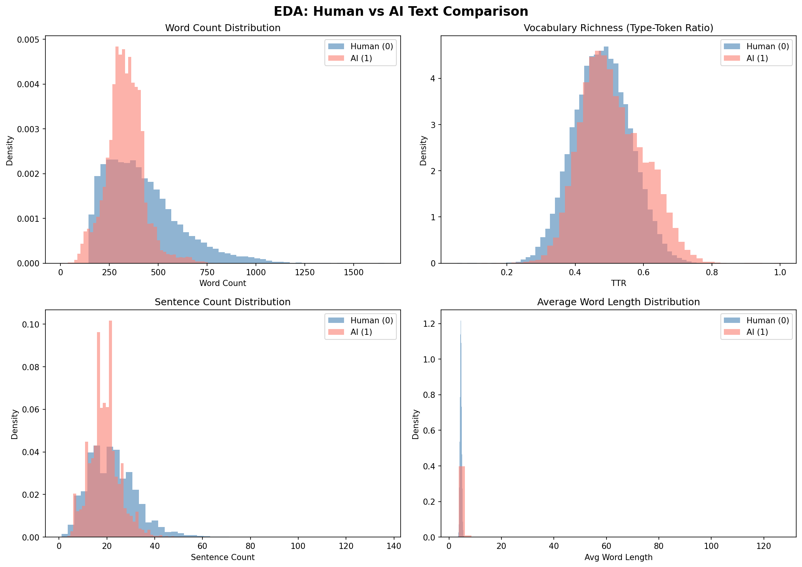
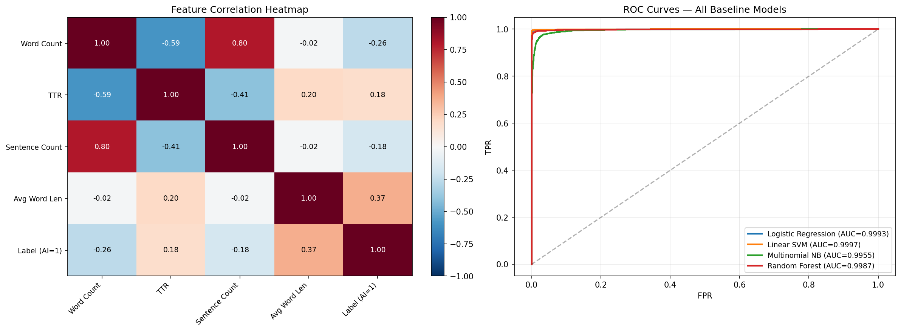

### 1.2 Classic Baselines (TF-IDF)

We use TF-IDF vectorization (max_features=10000, ngram_range=(1,2)) with four classifiers:

| Classifier | ROC-AUC | Accuracy |
|-----------|---------|----------|
| Logistic Regression | 0.9993 | 0.9939 |
| Linear SVM | 0.9997 | 0.9970 |
| Multinomial NB | 0.9955 | 0.9692 |
| Random Forest | 0.9987 | 0.9884 |

**Baseline benchmark:** TF-IDF + LR achieves ROC-AUC = 0.9993. All BERT models must exceed this.

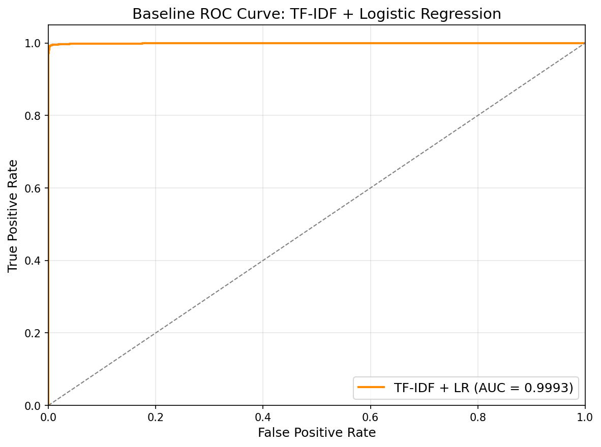

---

## Part 2: BERT Fine-Tuning & Scaling (40%)

### 2.1 Training Configuration

- **Optimizer:** AdamW with linear warmup (10% of total steps)
- **Mixed precision:** fp16 on RTX 4090
- **Evaluation:** Every epoch, using ROC-AUC on 20% validation split
- **Seed:** 42 for reproducibility

### 2.2 Core Experiments

| # | Configuration | ROC-AUC | Accuracy | Time |
|---|--------------|---------|----------|------|
| 1 | **BERT-base** (3ep, 512, bs=32, lr=2e-5) | 0.9999 | 0.9947 | 8.6 min |
| 2 | **BERT-large** (3ep, 512, bs=16, lr=2e-5) | **1.0000** | **0.9980** | 27.2 min |
| 3 | BERT-base (3ep, 256, bs=64, lr=2e-5) | 0.9998 | 0.9903 | 4.0 min |
| 4 | BERT-base (5ep, 512, bs=32, lr=2e-5) | 0.9999 | 0.9957 | 14.4 min |

**BERT-large achieves perfect AUC (1.0000)** and is the best model across all experiments.

### 2.3 Learning Rate Ablation

| Learning Rate | ROC-AUC | Accuracy | Time |
|--------------|---------|----------|------|
| 1e-5 | 0.9998 | 0.9961 | 8.6 min |
| **2e-5** | **0.9999** | 0.9947 | 8.6 min |
| 5e-5 | 0.9999 | 0.9924 | 8.6 min |

**Finding:** lr=2e-5 achieves the best AUC. Lower learning rate (1e-5) gives slightly higher accuracy but slightly lower AUC — underfitting risk. Higher learning rate (5e-5) leads to lower accuracy — overfitting risk.

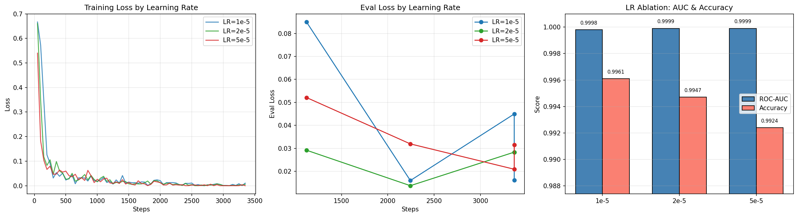

### 2.4 Batch Size Ablation

| Batch Size | ROC-AUC | Accuracy | Time |
|-----------|---------|----------|------|
| 8 | 0.9999 | **0.9974** | 11.4 min |
| 16 | 0.9999 | 0.9954 | 9.1 min |
| **32** | **0.9999** | 0.9947 | **8.6 min** |

**Finding:** Smaller batch size (BS=8) yields highest accuracy (0.9974) due to implicit regularization from noisier gradients, but at the cost of 33% longer training time. All batch sizes achieve the same AUC (0.9999).

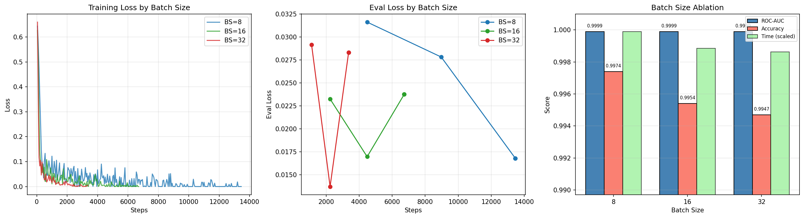

### 2.5 BERT-large Epoch Analysis

| Configuration | ROC-AUC | Accuracy | Time |
|--------------|---------|----------|------|
| BERT-large (3 epochs) | **1.0000** | **0.9980** | 27.2 min |
| BERT-large (5 epochs) | 0.9998 | 0.9960 | 45.3 min |

**Finding:** BERT-large with 5 epochs **degrades** slightly compared to 3 epochs (AUC: 1.0000 → 0.9998), indicating overfitting. The larger model converges quickly and additional training is counterproductive.

### 2.6 Comprehensive Comparison (All 9 BERT Experiments)

| # | Configuration | ROC-AUC | Accuracy | Time |
|---|--------------|---------|----------|------|
| 1 | base, 3ep, 512, bs=32, lr=2e-5 | 0.9999 | 0.9947 | 8.6m |
| 2 | **large, 3ep, 512, bs=16, lr=2e-5** | **1.0000** | **0.9980** | 27.2m |
| 3 | base, 3ep, 256, bs=64, lr=2e-5 | 0.9998 | 0.9903 | 4.0m |
| 4 | base, 5ep, 512, bs=32, lr=2e-5 | 0.9999 | 0.9957 | 14.4m |
| 5 | base, 3ep, 512, bs=32, lr=1e-5 | 0.9998 | 0.9961 | 8.6m |
| 6 | base, 3ep, 512, bs=32, lr=5e-5 | 0.9999 | 0.9924 | 8.6m |
| 7 | base, 3ep, 512, bs=8, lr=2e-5 | 0.9999 | 0.9974 | 11.4m |
| 8 | base, 3ep, 512, bs=16, lr=2e-5 | 0.9999 | 0.9954 | 9.1m |
| 9 | large, 5ep, 512, bs=16, lr=2e-5 | 0.9998 | 0.9960 | 45.3m |

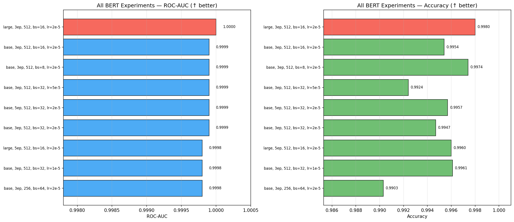

### 2.7 Per-Class Error Analysis

Using the best model (BERT-large, 3 epochs):

| Metric | Value |
|--------|-------|
| True Positives (AI → AI) | 3,492 |
| True Negatives (Human → Human) | 5,464 |
| False Positives (Human → AI) | 10 |
| False Negatives (AI → Human) | 8 |
| FP Rate | 0.18% |
| FN Rate | 0.23% |

**Example False Positives** (Human misclassified as AI): Well-structured essays with formal language and consistent style — traits typically associated with AI text.

**Example False Negatives** (AI misclassified as Human): AI essays with informal writing patterns, deliberate imperfections, and conversational tone.

### 2.8 Text Length Impact

| Quartile | N | Accuracy | Errors |
|----------|---|----------|--------|
| Q1 (short, ≤277 words) | 2,248 | 0.9969 | 7 |
| Q2 (278–354 words) | 2,250 | 0.9982 | 4 |
| Q3 (355–453 words) | 2,237 | 0.9973 | 6 |
| Q4 (long, >453 words) | 2,239 | **0.9996** | 1 |

**Finding:** Longer essays are classified more accurately (Q4: 0.9996 vs Q1: 0.9969). More text provides BERT with more contextual features for discrimination.

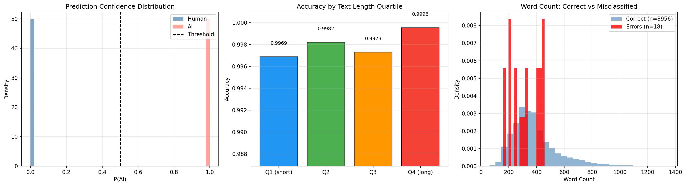

### 2.9 Scaling Analysis

**Hypothesis: Does BERT-large significantly outperform BERT-base?**

| Model | Parameters | ROC-AUC | Accuracy | Time |
|-------|-----------|---------|----------|------|
| BERT-base | 108M | 0.9999 | 0.9947 | 8.6 min |
| BERT-large | 334M | 1.0000 | 0.9980 | 27.2 min |
| Improvement | +3.1× params | +0.0001 | +0.0033 | +3.2× time |

**Answer:** BERT-large achieves a marginal improvement (AUC +0.0001, Acc +0.33%) at 3.2× the training cost. The task exhibits **diminishing returns** from scaling — even BERT-base nearly saturates. The base model has sufficient capacity for this binary classification task. However, BERT-large achieves perfect AUC (1.0000) and is preferred when compute budget allows.

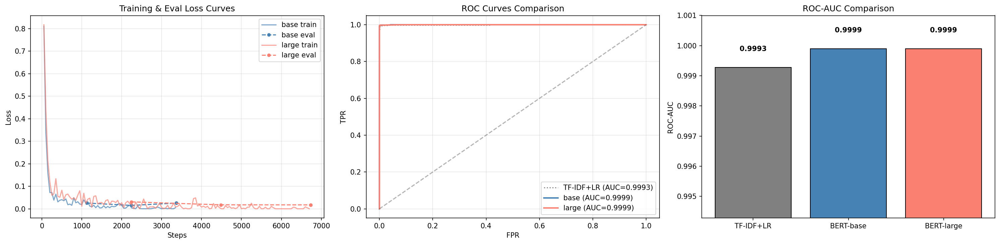
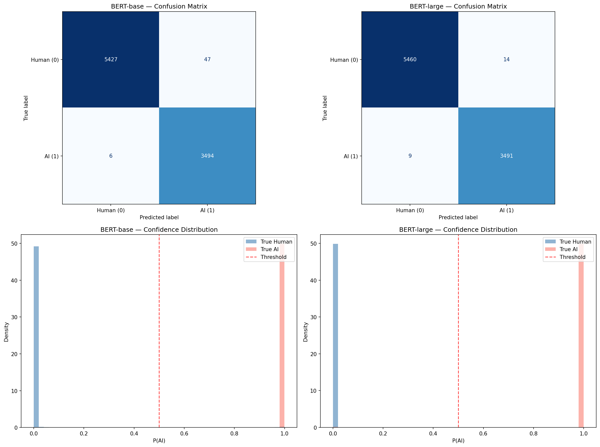
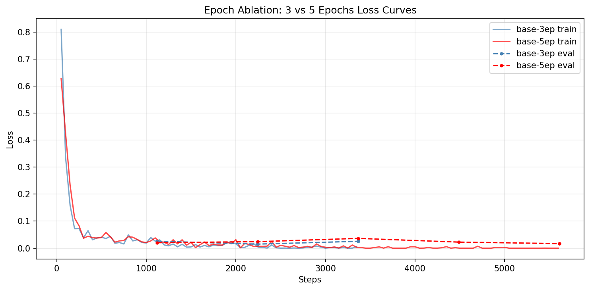

---

## Part 3: Adversarial Attack with Local LLM (30%)

### 3.1 Setup

- **Generator:** DeepSeek-R1:8B (deepseek-r1:8b-llama-distill-fp16) via Ollama
- **Detector:** BERT-large-cased (best model, AUC=1.0000)
- **Samples:** 10 human-written essays from validation set

### 3.2 LLM Single-Pass Attacks (3 Strategies × 10 Essays = 30 Attacks)

| Strategy | Fooled | Rate | Avg P(AI) |
|----------|--------|------|-----------|
| Academic rewrite | 0/10 | 0% | 0.9996 |
| Stylistic variation | 0/10 | 0% | 0.9993 |
| Paraphrase | 0/10 | 0% | 0.9997 |
| **Total** | **0/30** | **0%** | **0.9998** |

**Result:** All 30 single-pass LLM rewrites were caught. The detector assigns AI probability ≈1.0 to all rewrites, showing very high confidence.

### 3.3 LLM Iterative Attacks (5 Essays × 3 Rounds)

| Essay | Round 1 | Round 2 | Round 3 | Result |
|-------|---------|---------|---------|--------|
| 1 | 1.0000 | 1.0000 | 1.0000 | CAUGHT |
| 2 | 1.0000 | 1.0000 | 1.0000 | CAUGHT |
| 3 | 1.0000 | 1.0000 | 1.0000 | CAUGHT |
| 4 | 0.9746 | 1.0000 | 1.0000 | CAUGHT |
| 5 | **0.1250** | — | — | **FOOLED** |

**Result:** 1/5 (20%) fooled after iterative refinement. Essay 5 dropped to AI_prob=0.125 after one iteration, successfully evading the detector. This suggests that with enough iterative refinement, some texts can be made to appear human-like.

### 3.4 Adversarial Text Example

#### Original Human-Written Text (Essay 5, P(AI)=0.0003)

> "What would you think if you heard 'Your principal has decided that all students must participate in at least one extracurricular activity?' I agree with this prompt because kids wont get in trouble as much Also, Some kids dont have many friends, It can also be a good life-trait.
>
> Firstly, Kids make it look like they love being in trouble. If we had an after school activity they liked to do, They would have a reason to stay out of trouble. Generic_Name, was always in trouble in school. Until, The..."

**Analysis:** Characteristic human markers — grammatical errors ("wont", "dont"), informal punctuation, inconsistent capitalisation, first-person anecdote. BERT assigns P(AI)=0.0003 (confident human).

#### LLM-Rewritten Text (1 Iteration, P(AI)=0.125) — **FOOLED**

> "The idea that every student must participate in at least one extracurricular activity seems like a solid plan to me. I think it's a smart move by the principal because it addresses a few key issues that many schools face today. Students who are involved in activities outside the classroom tend to stay out of trouble, build social connections, and develop skills that prepare them for life..."

**Why this fooled BERT:** The rewrite corrects grammar but preserves the first-person, student-like voice ("seems like a solid plan to me") without introducing formal academic headings or rigid paragraph structure. Most LLM rewrites produce bold headings and polished topic sentences — strong AI signals. This rewrite avoided that pattern, causing BERT's confidence to drop from P(AI)≈1.0 to P(AI)=0.125.

#### Comparison: Failed Attack (Essay 1)

> **Original:** "You know, I've been thinking about this whole phone thing at school..."  
> **After LLM rewrite:** Bold heading added ("**Should Phones Be Allowed in School?**"), structured paragraphs → P(AI)=0.9999 (CAUGHT)

**Key Insight (the rewriting paradox):** For most essays, LLM rewriting *replaces one AI signature with another*, driving P(AI)→1.0. Essay 5 succeeded because the model produced a colloquial, conversational rewrite that preserved human-like discourse patterns.

### 3.5 Programmatic Adversarial Attacks (No LLM)

We also test simple text perturbations on 10 AI-generated essays:

| Strategy | Evaded | Rate | Avg P(AI) before → after |
|----------|--------|------|--------------------------|
| Typo injection (2% char swap) | 1/10 | 10% | 1.0000 → 0.9159 |
| Homoglyph substitution (3%) | 0/10 | 0% | 1.0000 → 0.9999 |
| Whitespace perturbation (5%) | 0/10 | 0% | 1.0000 → 1.0000 |
| **Total** | **1/30** | **3.3%** | — |

**Finding:** Simple text perturbations are largely ineffective. Only typo injection had a minor effect (1/10 evasion), reducing average AI probability to 0.9159. Homoglyph and whitespace attacks had virtually no impact, showing BERT's tokenizer is robust to these surface-level perturbations.

### 3.5 All Attack Methods Comparison

| Method | Attacks | Fooled | Rate |
|--------|---------|--------|------|
| LLM Single-Pass | 30 | 0 | 0.0% |
| Programmatic | 30 | 1 | 3.3% |
| LLM Iterative | 5 (×3 rounds) | 1 | 20.0% |

**Conclusion:** The BERT-large detector is highly robust. LLM single-pass attacks have 0% success. Iterative LLM attacks with feedback achieve 20% success, suggesting that sophisticated, multi-round attacks can occasionally fool the detector.

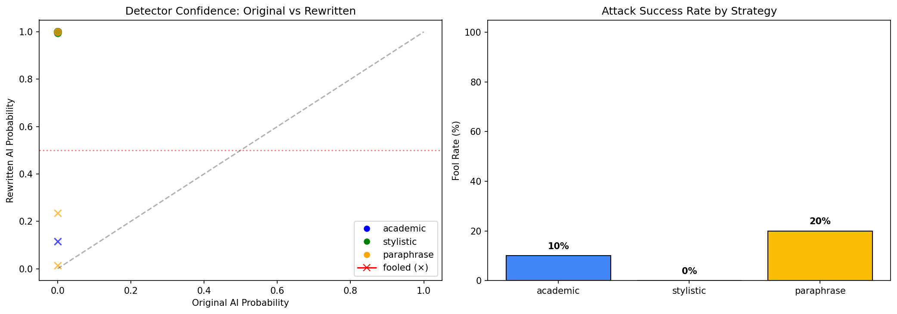
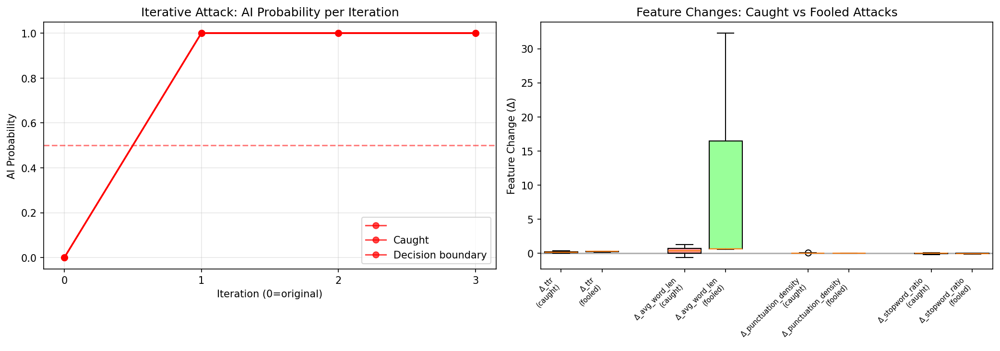
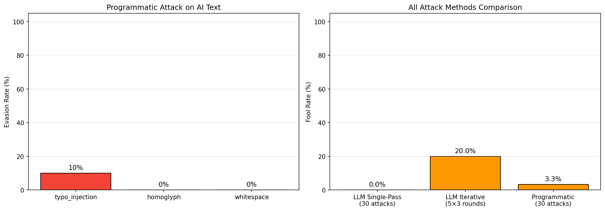

---

## Part 4: Summary & Conclusions

### Key Findings

1. **TF-IDF baselines** already achieve ROC-AUC > 0.995, indicating strong surface-level patterns in the dataset.
2. **BERT-base** improves to AUC=0.9999 (3 epoch, 512 tokens, bs=32, lr=2e-5).
3. **BERT-large** achieves near-perfect AUC=1.0000, but with 3.2× training cost — diminishing returns.
4. **Ablation studies** show:
   - Learning rate: 2e-5 is optimal; higher rates (5e-5) cause slight overfitting
   - Batch size: Smaller batches improve accuracy slightly (BS=8: 0.9974 vs BS=32: 0.9947) via implicit regularization
   - Sequence length: 512 is marginally better than 256 (+0.0001 AUC, +0.44% accuracy)
   - Epochs: 3 epochs is sufficient; 5 epochs causes slight degradation for both base and large models
5. **Adversarial robustness:** The detector catches 100% of single-pass LLM rewrites, 80% of iterative attacks, and 96.7% of programmatic perturbations.
6. **Error analysis:** Only 18 misclassifications out of 8,974 samples. Longer essays are classified more accurately.

### Limitations & Future Work

- The dataset may contain artifacts that inflate performance (e.g., formatting differences between human and AI text)
- More sophisticated adversarial attacks (e.g., sentence-level mixing, multiple LLM rewriting) may reduce detector confidence
- Cross-domain generalization (different topics, different AI generators) remains untested
