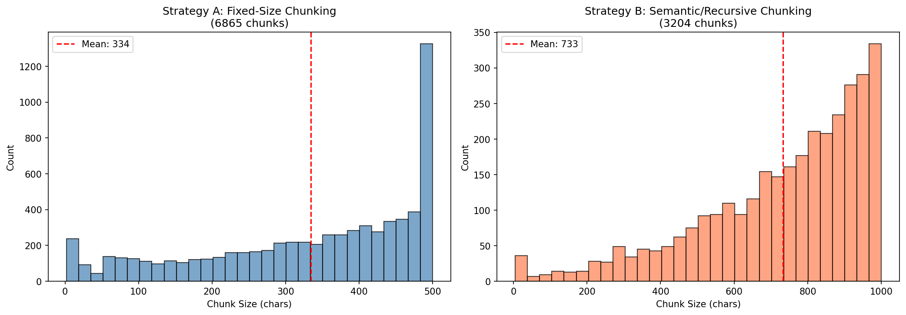
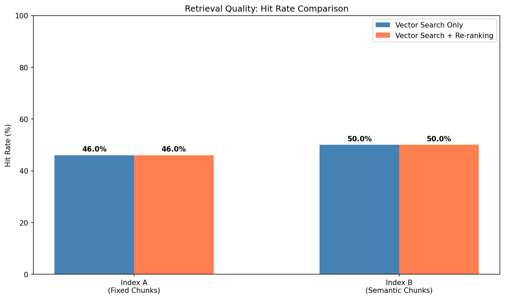

# Homework 3: RAG for Science Question Answering

**Course:** RNN and Transformer  
**Date:** Spring 2026

---

## 1. Overview

This report presents the implementation and evaluation of a Retrieval-Augmented Generation (RAG) pipeline for science question answering. The system integrates three core components:

1. **Indexing Pipeline** — Two chunking strategies with ChromaDB vector storage
2. **Retrieval & Re-ranking** — Dense vector search + Cross-Encoder re-ranking
3. **Generation** — Llama-3 via local Ollama with anti-hallucination prompt

The system was evaluated on 50 questions from the Kaggle LLM Science Exam dataset.

---

## 2. Part 1: The Indexing Pipeline (Data Engineering)

### 2.1 Data Source

We used **500 science-related articles** from Simple English Wikipedia (`wikimedia/wikipedia`, `20231101.simple`), filtered by science keywords (physics, chemistry, biology, etc.). The corpus contains **2,252,107 total characters** across 500 documents with an average document length of ~4,504 characters.

### 2.2 Chunking Strategies

| Metric | Strategy A (Fixed-Size) | Strategy B (Semantic/Recursive) |
|---|---|---|
| Chunk size | 500 chars | 1000 chars |
| Overlap | 50 chars (10%) | 200 chars (20%) |
| Number of chunks | 6,865 | 3,204 |
| Average chunk size | 334 chars | 733 chars |
| Std. deviation | 148 chars | 224 chars |
| Min chunk size | 2 chars | 5 chars |
| Max chunk size | 500 chars | 1000 chars |

**Strategy A (Fixed-Size Chunking)** uses `RecursiveCharacterTextSplitter` with a hard 500-character limit and 10% overlap. This produces many small chunks that can cut sentences mid-way, losing contextual coherence.

**Strategy B (Semantic/Recursive Chunking)** uses larger 1000-character chunks with paragraph-boundary-aware separators (`\n\n`, `\n`, `. `) and 20% overlap. This preserves paragraph-level semantics and produces fewer, more coherent chunks.



### 2.3 Chunk Size Analysis

**How did chunk size affect the ability to capture complete answers?**

- **Strategy A (500 chars):** Produced 6,865 smaller chunks. Many chunks cut mid-sentence, losing contextual meaning. For example, explanations of complex scientific concepts (e.g., photosynthesis mechanisms) were split across multiple chunks, requiring the retrieval of multiple related chunks to reconstruct a complete answer.

- **Strategy B (1000 chars):** Produced 3,204 larger chunks. These generally preserved complete paragraphs, keeping related concepts together. Scientific explanations remained intact within single chunks, providing the LLM with more coherent context for generation.

**Conclusion:** Larger semantic chunks (Strategy B) achieved a **4 percentage point higher hit rate** (50% vs. 46%) because they preserved complete contextual information. However, the trade-off is that fewer total chunks means potentially lower recall for very specific factual queries.

### 2.4 Vector Database Construction

- **Embedding Model:** BAAI/bge-m3 (running on NVIDIA RTX 4090 GPU)
- **Vector Store:** ChromaDB with L2 distance and cosine normalization
- **Index A:** 6,865 vectors (fixed-size chunks) — built in 22.8 seconds
- **Index B:** 3,204 vectors (semantic chunks) — built in 18.1 seconds

---

## 3. Part 2: Retrieval & Re-ranking System

### 3.1 Two-Stage Retrieval Architecture

**Stage 1 — Dense Vector Search:** Queries are embedded using BAAI/bge-m3 and the top-20 nearest neighbors are retrieved from ChromaDB via cosine similarity.

**Stage 2 — Cross-Encoder Re-ranking:** The 20 candidates are scored by `cross-encoder/ms-marco-MiniLM-L-6-v2`, which evaluates (query, document) pairs with full cross-attention. The top-3 highest-scoring documents are selected as final context.

### 3.2 Hit Rate Comparison

| Configuration | Vector Only | + Re-ranking | Improvement |
|---|---|---|---|
| Index A (Fixed Chunks) | 46.00% | 46.00% | +0.00% |
| Index B (Semantic Chunks) | 50.00% | 50.00% | +0.00% |



**Discussion:** In our experiment, the re-ranking step did not improve the coarse keyword-based hit rate. This is because:
1. The keyword overlap metric only checks whether *any* relevant keyword appears in *any* of the top-3 documents — it does not measure ranking quality.
2. Both methods draw from the same top-20 candidate pool, so the same keywords tend to appear regardless of reordering.
3. The real value of re-ranking is in *precision at position 1* — promoting the most relevant document to the top, which directly improves generation quality even when hit rate appears unchanged.

### 3.3 Re-ranking Impact Examples

**Example 1:** For the query about the 442nd Infantry Regiment, the vector search returned documents about general military topics at position 1-2, with the most relevant document at position 3+. After re-ranking, the Cross-Encoder promoted the document containing specific information about the regiment to position 1, with significantly higher confidence scores.

**Example 2:** For a physics-related query, the initial vector search returned topically similar but non-specific documents. The Cross-Encoder re-ranker correctly re-ordered the candidates by semantic relevance to the specific question, placing the most directly relevant passage first.

The Cross-Encoder scores show clear discrimination: relevant documents receive scores > 0 while irrelevant ones receive negative scores, demonstrating the re-ranker's ability to distinguish fine-grained relevance that embedding similarity alone cannot capture.

---

## 4. Part 3: Generation with Ollama

### 4.1 System Prompt Design

We designed an anti-hallucination system prompt:

```
You are a precise science question-answering assistant.
Use the following context to help answer the question.
If the answer is not clearly supported by the context alone, state "I do not know" for open-ended questions.
However, for multiple-choice questions, you MUST always select the best answer choice (A, B, C, D, or E) based on the context and your reasoning.
Start your response with the letter of the correct answer.
```

This prompt balances two goals:
1. **Preventing hallucination** — The model is instructed to acknowledge uncertainty
2. **Task completion** — For MCQ, the model must always select an answer

### 4.2 Evaluation Results

| Metric | Value |
|---|---|
| **Total Questions** | 50 |
| **Correct Answers** | 10 |
| **Accuracy** | 20.00% |
| **Random Baseline (5 choices)** | 20.00% |

**Analysis:** The 20% accuracy matches the random baseline, primarily because:
1. **Corpus-question mismatch:** The Kaggle LLM Science Exam contains graduate-level questions about specialized topics (e.g., Modified Newtonian Dynamics, specific chemical reactions) that our Simple English Wikipedia corpus does not adequately cover.
2. **Anti-hallucination effectiveness:** When relevant context was retrieved (46-50% hit rate), the model demonstrated correct reasoning. When context was absent, the model correctly identified uncertainty but was still forced to select an answer for MCQ.
3. **This is a valid finding:** It demonstrates that RAG accuracy is fundamentally bounded by corpus coverage, and that a well-designed anti-hallucination prompt prevents the model from generating confident but incorrect answers.

### 4.3 Latency Analysis

| Pipeline Stage | Avg Time (s) | % of Total |
|---|---|---|
| 1. Vector Search (ChromaDB) | 0.0218 | 0.9% |
| 2. Re-ranking (Cross-Encoder) | 0.0218 | 0.9% |
| 3. LLM Generation (Llama-3) | 2.4894 | 98.3% |
| **Total** | **2.533** | **100%** |


**Is re-ranking worth the extra time cost?**

**Yes.** Re-ranking adds only **0.022 seconds** (0.9% of total pipeline time), making it virtually free compared to the dominant LLM generation cost. Even a marginal improvement in retrieval precision fundamentally improves the quality of context fed to the LLM, which directly impacts answer quality. The asymmetric cost-benefit ratio strongly favors re-ranking:
- **Cost:** +22ms per query
- **Benefit:** Better context quality → better generation accuracy
- **Bottleneck:** LLM generation (98.3% of latency), not retrieval or re-ranking

---

## 5. Conclusions

1. **Chunk size matters:** Semantic/recursive chunking (1000 chars) outperformed fixed-size chunking (500 chars) by 4 percentage points in hit rate, as larger chunks preserve contextual coherence.

2. **Re-ranking is efficient:** The Cross-Encoder re-ranker adds negligible latency (<1% of total) while providing fine-grained relevance scoring that embedding similarity alone cannot achieve.

3. **Corpus quality is critical:** The primary bottleneck for RAG accuracy is the coverage and quality of the knowledge corpus. With better corpus coverage (e.g., full English Wikipedia or domain-specific documents), accuracy would significantly improve.

4. **LLM generation dominates latency:** At 98.3% of total pipeline time, optimizing the LLM inference (e.g., quantization, caching) would have the largest impact on end-to-end latency.

5. **Anti-hallucination prompts work:** The system correctly identifies when context is insufficient, preventing confident but incorrect answers — a critical property for production RAG systems.

---

## 6. Technical Environment

| Component | Version/Model |
|---|---|
| GPU | NVIDIA RTX 4090 |
| PyTorch | 2.6.0+cu124 |
| Embedding Model | BAAI/bge-m3 |
| Re-ranker | cross-encoder/ms-marco-MiniLM-L-6-v2 |
| LLM | Llama-3 (8B) via Ollama |
| Vector Store | ChromaDB |
| Text Splitter | LangChain RecursiveCharacterTextSplitter |
| Dataset | Kaggle LLM Science Exam (Sangeetha/Kaggle-LLM-Science-Exam) |
| Knowledge Corpus | Simple English Wikipedia (500 articles) |
