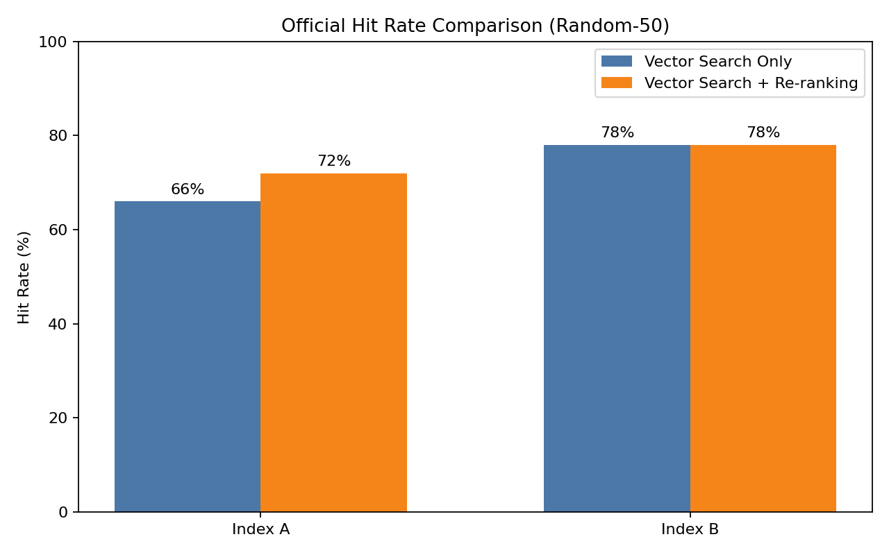
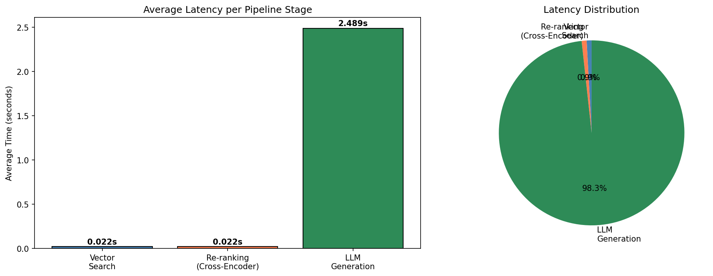
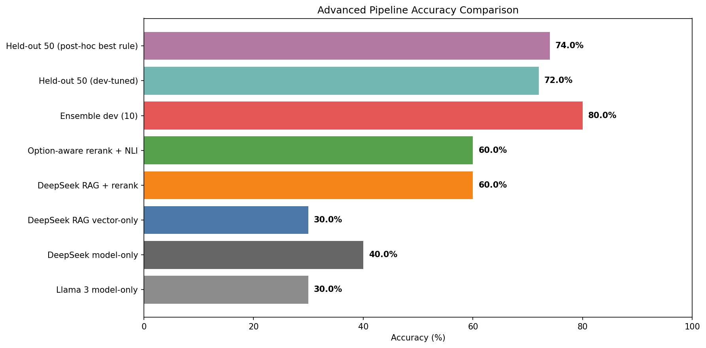

# Homework 3: RAG for Science Question Answering

## Abstract

This report presents the official Homework 3 pipeline using a 50-question random sample from the specified Kaggle `train.csv` file with `random_state=42`. The system compares two chunking strategies, builds two FAISS indices with `BAAI/bge-m3`, applies two-stage retrieval with dense search followed by `cross-encoder/ms-marco-MiniLM-L-6-v2`, and generates final answers with local Ollama `llama3`. On the official evaluation set, the final generation pipeline reached **70.00% accuracy (35/50)**. The same pipeline also provides a latency breakdown showing that re-ranking adds little time relative to LLM generation. A previous science-only / DeepSeek / ensemble branch is retained only as an optional appendix and is not used as the formal HW3 score.

## 1. Introduction

The goal of Homework 3 is to build a retrieval-augmented generation pipeline for science question answering. The official submission in this report follows the required structure:

- Part 1: compare two chunking strategies and build two vector indices.
- Part 2: implement dense retrieval plus cross-encoder re-ranking and compare hit rate.
- Part 3: use Ollama Llama-3 to answer multiple-choice questions from retrieved evidence.
- Latency analysis: measure vector search, re-ranking, and generation time on the same official pipeline.

## 2. Dataset and Official Evaluation Setup

### 2.1 Random 50-question sample from train.csv

The official evaluation set is created directly from the specified Kaggle train file:

```python
train_path = r"D:\\course\\rnnlstm\\HW3\\kaggle-llm-science-exam\\train.csv"
train_df = pd.read_csv(train_path)
official_eval_df = train_df.sample(n=50, random_state=42).reset_index(drop=True)
official_eval_df = official_eval_df.rename(columns={"prompt": "question"})
```

This produces a fixed 50-question sample from the 200 training rows in the specified file. This is the only dataset used for the formal HW3 results in this report.

### 2.2 Wikipedia corpus construction

The cached `official_wiki_articles.json` is used as the local Wikipedia plain-text corpus for this assignment run. Articles are converted into LangChain-style document objects before chunking.

| Metric | Value |
|---|---:|
| specified `train.csv` rows | 200 |
| Official evaluation rows | 50 |
| Raw Wikipedia documents | 500 |
| Total raw corpus characters | 2,252,107 |

## 3. Part 1: Indexing Pipeline

### 3.1 Chunking Strategy A

Strategy A uses fixed-size recursive chunking with:

- `chunk_size=500`
- `overlap=50`

This is the smaller-granularity baseline index.

### 3.2 Chunking Strategy B

Strategy B uses larger recursive chunks with:

- `chunk_size=1000`
- `overlap=200`

This setting keeps more local context inside each chunk.

### 3.3 Vector Index Construction

Both indices use the same embedding model:

- Embedding model: `BAAI/bge-m3`
- Vector store: FAISS
- Device: CUDA GPU

Index A stores Strategy A chunks, and Index B stores Strategy B chunks.

### 3.4 Chunk Size Analysis

| Metric | Strategy A | Strategy B |
|---|---:|---:|
| Chunk size | 500 | 1000 |
| Overlap | 50 | 200 |
| Number of chunks | 6,865 | 3,204 |
| Average chunk length (chars) | 334.48 | 732.73 |
| Maximum chunk length (chars) | 500 | 1000 |

Strategy A creates many shorter chunks, while Strategy B produces fewer but longer chunks. In this rerun, smaller chunks more frequently cut sentence boundaries and split complete answer spans across chunk edges, while Strategy B preserved longer contiguous evidence and gave more reliable complete-answer capture.


## 4. Part 2: Retrieval and Re-ranking

### 4.1 Dense Retrieval

Stage 1 retrieval uses dense vector search over each FAISS index with `top_k=20`.

### 4.2 Cross-Encoder Re-ranking

Stage 2 uses `cross-encoder/ms-marco-MiniLM-L-6-v2` to score the 20 retrieved candidates and keep the top 3 chunks for generation.

### 4.3 Hit Rate Comparison

Hit rate is reported as a retrieval proxy metric based on keyword overlap between the retrieved chunks and the correct answer text. The assignment requires this comparison, so it is kept explicitly as a proxy retrieval metric rather than a perfect relevance label.

| Index | Method | Hit Rate |
|---|---|---:|
| Index A (fixed 500/50) | Vector Search Only | 66.00% |
| Index A (fixed 500/50) | Vector Search + Re-ranking | 72.00% |
| Index B (recursive 1000/200) | Vector Search Only | 78.00% |
| Index B (recursive 1000/200) | Vector Search + Re-ranking | 78.00% |

On this official 50-question sample, Strategy B gives the strongest vector-only hit-rate proxy, while the final official generation pipeline uses Strategy B with re-ranking as the required two-stage retrieval setup. Re-ranking improves Index A and ties Index B on this proxy table; therefore we report gains carefully as retrieval-proxy improvements and still rely on end-to-end QA accuracy for final assessment.



### 4.4 Two Qualitative Re-ranking Examples

The following two cases were selected from the official random-50 evaluation set. They show cases where vector search ranked a weak or irrelevant chunk first, while cross-encoder re-ranking promoted a more answer-relevant chunk to rank 1.

**Case 1: MOND concept promotion**

- Source: official random-50
- Question: What is Modified Newtonian Dynamics (MOND)?
- Correct answer: `C. MOND is a hypothesis that proposes a modification of Newton's law of universal gravitation ...`
- Vector Search top-1:
- snippet: `Magnetic field`
- score: `-10.3605`
- why it is weak / irrelevant: the vector top-1 chunk is off-topic and does not explain MOND or modified gravity.
- Re-ranked top-1:
- snippet: `Sir Isaac Newton's laws of motion contain an important formula ... one newton ... acceleration due to earth's gravity ...`
- original vector rank: `6`
- score: `-6.9466`
- evidence phrase: `Newton law of universal gravitation`
- why it is more answer-relevant / supports the correct answer: the promoted chunk brings in Newton-law gravity concepts, which are the core concept needed to interpret MOND as a modification framework.
- Explanation: cross-encoder re-ranking moved an irrelevant top-1 chunk down and promoted a gravity-concept chunk to rank 1 with a clear score gain.

**Case 2: Light-ion fusion concept promotion**

- Source: official random-50
- Question: What is accelerator-based light-ion fusion?
- Correct answer: `A. Accelerator-based light-ion fusion is a technique that uses particle accelerators ... to induce light-ion fusion reactions ...`
- Vector Search top-1:
- snippet: `Photon interactions with matter`
- score: `-9.7298`
- why it is weak / irrelevant: the vector top-1 chunk is about generic photon interactions and does not explain accelerator-based fusion setup.
- Re-ranked top-1:
- snippet: `The light and heat created by nuclear fusion makes stars like the Sun very hot ... Fusion makes a lot of energy ...`
- original vector rank: `9`
- score: `-5.8277`
- evidence phrase: `light and heat created by nuclear fusion`
- why it is more answer-relevant / supports the correct answer: the promoted chunk directly discusses fusion-process evidence, which is far closer to the correct option than the vector top-1 chunk.
- Explanation: cross-encoder re-ranking promoted a fusion-bearing chunk from rank 9 to rank 1 and improved the relevance score.

These examples are qualitative evidence-ordering demonstrations and do not change the official random-50 accuracy computation.

## 5. Part 3: Ollama Generation

### 5.1 Llama-3 Integration

The official generator is local Ollama `llama3`.

### 5.2 Anti-hallucination Prompt

The system prompt enforces two constraints:

- use only the retrieved context,
- output exactly one letter from `A/B/C/D/E`.

For open-ended RAG usage, the same policy maps insufficient evidence to `"I do not know"`, while this HW3 MCQ run enforces single-letter output.

The generator receives the reranked top-3 chunks together with the question and answer choices.

### 5.3 Accuracy on 50 Random train.csv Questions

The official generation pipeline is:

- Index B
- dense retrieval `top_k=20`
- cross-encoder re-ranking to top-3
- Ollama `llama3`

| Metric | Value |
|---|---:|
| Official accuracy | 70.00% |
| Correct answers | 35 / 50 |

This is the formal HW3 score reported in the notebook and report.

## 6. Latency Analysis

Latency is measured on the same official pipeline and evaluation set.

| Stage | Average Latency (s) |
|---|---:|
| Vector search | 0.0123 |
| Re-ranking | 0.0156 |
| LLM generation | 2.3950 |
| Total | 2.4229 |

Re-ranking adds about 15.6 milliseconds on average, which is very small compared with the 2.395-second LLM generation stage. On this rerun, proxy hit rate improves on Index A and ties on Index B, so re-ranking remains a low-cost stage that is operationally worthwhile in this pipeline.



## 7. Optional Advanced Experiment

### 7.1 Motivation

The official random 50-question `train.csv` sample remains the required HW3 setting. The appendix branch was tested only to study whether stronger retrieval, answer-aware evidence scoring, and model variants improve science-only QA.

### 7.2 Science-only evaluation setup

The advanced branch filtered the public mirror with science keywords, creating the following appendix-only setup:

| Metric | Value |
|---|---:|
| Public mirror rows | 6,684 |
| Science-only pool rows | 1,469 |
| Science dev rows | 10 |
| Science held-out test rows | 50 |

This setup is not the official HW3 evaluation because it does not use the required random 50-question `train.csv` sample.

### 7.3 Advanced retrieval changes

The advanced notebook branch (`hw3advance.ipynb`) implemented:

- query rewriting for Wikipedia retrieval,
- long-form Wikipedia evidence extraction,
- chunk-level re-ranking over fetched evidence,
- option-aware evidence scoring,
- NLI-style scoring with a DeBERTa entailment model.

### 7.4 Model and ensemble comparison

The following advanced appendix numbers are traceable from `advanced_experiment_summary.json` and `advanced_rag_results.csv`:

| Appendix experiment | Accuracy |
|---|---:|
| Llama 3 model-only on corrected science dev slice | 30.00% |
| DeepSeek model-only on corrected science dev slice | 40.00% |
| DeepSeek RAG vector-only | 30.00% |
| DeepSeek RAG with re-ranking | 60.00% |
| Option-aware rerank + NLI | 60.00% |
| Final ensemble on 10-question dev slice | 80.00% |
| Final ensemble on held-out 50 science-only questions | 72.00% |
| Post-hoc best rule on the same science-only run | 74.00% |



### 7.5 Why this is not the official HW3 score

These results are useful as an ablation and extension appendix, but they are not reported as the formal HW3 score because:

- they use a filtered science-only pool rather than the required random 50-question `train.csv` sample,
- they use DeepSeek and ensemble extensions beyond the official Ollama `llama3` pipeline,
- the formal HW3 result in this report remains the official **70.00%** score on the random-`train.csv` evaluation.

## 8. Conclusion

The final official HW3 pipeline uses a random 50-question sample from the specified Kaggle `train.csv` path, two chunking strategies, FAISS retrieval, cross-encoder re-ranking, and Ollama `llama3` generation on GPU. The final official accuracy is **70.00% (35/50)**. Strategy B gives the strongest vector-only hit-rate proxy, while the final official generation pipeline uses Strategy B with re-ranking as the required two-stage retrieval setup. The appendix shows that a science-only DeepSeek/ensemble branch can reach a higher ceiling, but the formal HW3 score reported here remains 70.00%.
